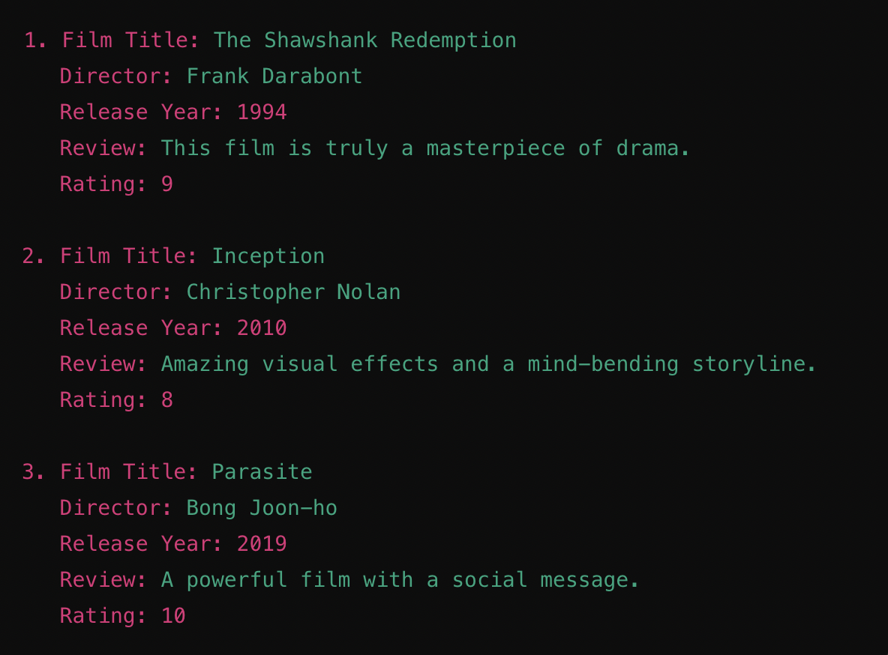

# Projects
I asked ChatGPT to provide project tasks for me. Here are projects that I have completed and am currently completing.

## First Project

**Project Task: Film Review and Rating Application**

**Description**

This project involves developing an application where users can record and rate film reviews. Users can input information such as title, director, release year, review text, and rating for each film. Additionally, users can list their added films, search among films, and sort films based on ratings.

**Tasks**

1. Prompt the user to enter film details (title, director, release year, review text, and rating).
2. Store this information in a data structure (e.g., list or dictionary).
3. Allow users to list their added films and perform searches (e.g., listing films released in a specific year or searching by title).
4. Sort films based on user ratings (from highest to lowest).

**Example Output**

